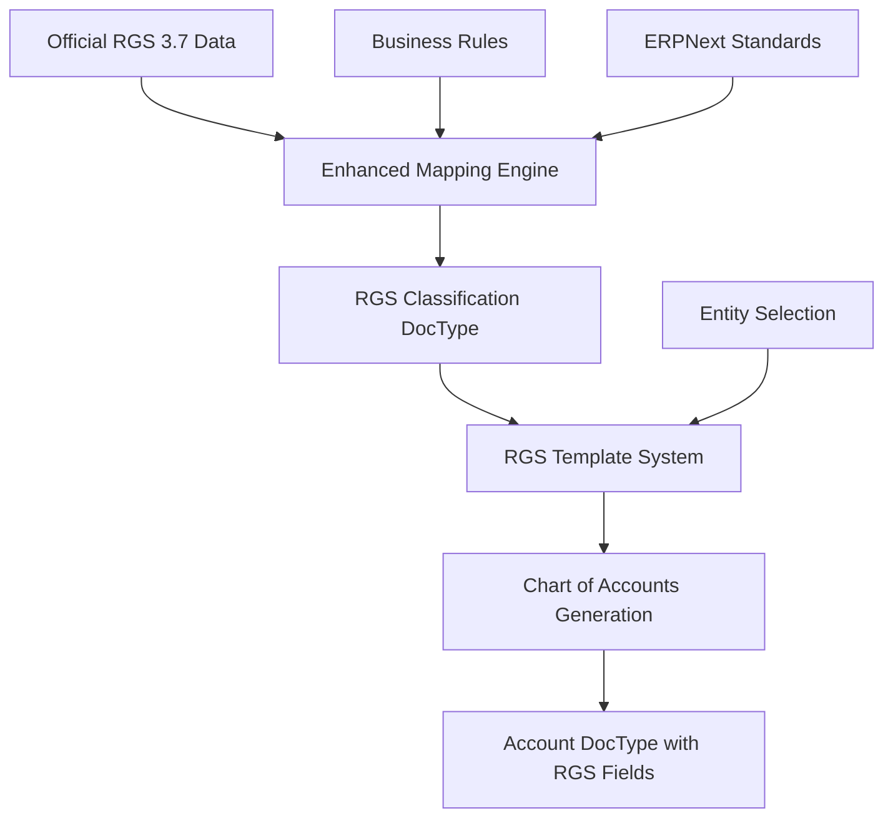

# RGS MKB Design Specification
## Dutch RGS 3.7 ERPNext Integration Architecture

**Version:** 1.0  
**Date:** August 22, 2025  
**Status:** PRODUCTION READY  
**Target:** ERPNext 15.x with Dutch RGS 3.7 Compliance

## 1. Executive Summary

### 1.1 Project Overview
The Dutch RGS MKB (Reference Classification System - Midden en Klein Bedrijf) integration provides comprehensive ERPNext support for Dutch SME financial compliance. This specification details the technical architecture, implementation patterns, and deployment strategies for bringing official Dutch RGS 3.7 standards to ERPNext installations.

### 1.2 Compliance Objectives
- **Legal Compliance**: Meet Dutch financial reporting requirements (Article 2:362 BW)
- **SME Focus**: Optimized templates for small and medium enterprises
- **Entity-Specific**: Support for ZZP, BV, EZ, and SVC legal structures
- **Professional Audit-Ready**: Complete Chart of Accounts structure with proper classification

### 1.3 Technical Foundation
- **ERPNext Integration**: Native DocType extensions with custom fields
- **Data Architecture**: 1,598 official RGS codes with intelligent ERPNext mapping
- **Build Optimization**: Docker-ready with pre-processed fixtures for rapid deployment
- **Multi-Entity**: Template-based approach supporting diverse Dutch business structures

## 2. Architectural Design

### 2.1 Core Components

```
nl_erpnext_rgs_mkb/
├── doctype/
│   ├── rgs_classification/        # Master RGS code repository
│   ├── rgs_template/              # Entity-specific templates
│   └── rgs_template_item/         # Template composition elements
├── fixtures/
│   ├── rgs_classification.json    # 1,598 enhanced RGS codes
│   └── custom_field.json          # Account DocType extensions
├── utils/
│   ├── enhanced_rgs_mapping.py    # Intelligent ERPNext mapping logic
│   └── build_utils.py             # Docker build optimizations
└── public/
    ├── css/app.css               # UI enhancements
    └── js/index.js               # Client-side logic
```

### 2.2 Data Flow Architecture



### 2.3 Integration Patterns

**Three-Document Integration Approach:**
1. **RGS Classification**: Master data repository for all RGS codes
2. **RGS Template**: Entity-specific account selection and customization
3. **Account Enhancement**: Native ERPNext Account DocType with RGS custom fields

**Smart Mapping Strategy:**
- **Structure Analysis**: RGS code hierarchy patterns (B → BIva → BIvaKou)
- **Description Intelligence**: Dutch keyword analysis for account type determination
- **D/C Logic**: Debit/Credit indicators for balance validation
- **Entity Filtering**: Applicability rules for ZZP/BV/EZ/SVC structures

## 3. Detailed Component Specifications

### 3.1 RGS Classification DocType

**Purpose**: Master repository for all official RGS 3.7 codes with ERPNext mapping intelligence

**Core Fields:**
```python
rgs_code: str           # Primary key (e.g., "BIvaKou")
rgs_omskort: str        # Short Dutch description
rgs_reknr: str          # 5-digit SME reference number
rgs_dc: str             # Debit/Credit indicator
rgs_nivo: int           # Hierarchy level (1-5)
rgs_description: str    # Full Dutch description
rgs_description_en: str # English translation
rgs_status: str         # Active/Inactive status
rgs_versie: str         # RGS version (3.7)
```

**ERPNext Integration Fields:**
```python
erpnext_root_type: str      # Asset/Liability/Equity/Income/Expense
erpnext_account_type: str   # Specific ERPNext account type
erpnext_report_type: str    # Balance Sheet/Profit and Loss
balance_must_be: str        # Debit/Credit validation
is_group: bool              # Group vs. leaf account determination
```

**Entity Applicability:**
```python
rgs_zzp: str    # Applicable for ZZP (Y/N)
rgs_ez: str     # Applicable for EZ (Y/N)
rgs_bv: str     # Applicable for BV (Y/N)
rgs_svc: str    # Applicable for SVC (Y/N)
```

**Hierarchy Management:**
- Uses ERPNext NestedSet for tree structure
- Parent-child relationships based on RGS code patterns
- Automatic group/leaf determination based on nivo level

### 3.2 RGS Template System

**Purpose**: Entity-specific Chart of Accounts template builder

**RGS Template DocType:**
```python
template_name: str          # Template identifier
entity_type: str            # ZZP/EZ/BV/SVC
description: str            # Template description
generation_rules: JSON     # Customization rules
is_default: bool            # Default template flag
```

**RGS Template Item (Child Table):**
```python
rgs_classification: Link   # Link to RGS Classification
account_name: str          # Customized account name
account_number: str        # Custom numbering
is_mandatory: bool         # Required for entity type
custom_account_type: str   # Override account type
include_in_coa: bool       # Include in generation
```

**Generation Rules JSON Schema:**
```json
{
  "include_starting_balances": false,
  "enforce_balance": true,
  "include_inactive": false,
  "only_mkb_standard": true,
  "custom_numbering_start": 10000,
  "account_naming_convention": "rgs_description"
}
```

### 3.3 Account DocType Extensions

**Custom Fields Added to Account:**
```python
rgs_code: str               # RGS classification reference
rgs_nivo: int               # RGS hierarchy level
rgs_referentienummer: str   # RGS reference number
rgs_template: Link          # Source template reference
is_rgs_compliant: bool      # Compliance flag
```

**Validation Hooks:**
- RGS code format validation
- Classification existence verification
- Balance requirement enforcement
- Account type consistency checks

### 3.4 Dutch Tax Integration Research 📋 

**Phase 3 Development Priority:**

The integration of Dutch tax rates with RGS classifications requires comprehensive research into ERPNext's tax system architecture:

**Key Research Areas:**

1. **Tax Rate Field Integration:**
   ```python
   # ERPNext CoA Template supports tax_rate field
   "account_name": "BTW 21% Inkoop",
   "account_number": "1405", 
   "account_type": "Tax",
   "tax_rate": 21.0  # Automatic Dutch VAT rate assignment
   ```

2. **ERPNext Tax DocTypes Integration:**
   - **Tax Category**: Link RGS account types to tax categories (Standard, Zero-Rated, Exempt)
   - **Tax Rule**: Define automatic tax selection based on RGS classification
   - **Tax Template**: Create Dutch-specific VAT templates (21%, 9%, 0%)

3. **Dutch VAT Classification Mapping:**
   ```python
   RGS_TAX_MAPPING = {
       'verkopen_algemeen': {'tax_rate': 21.0, 'tax_category': 'Standard'},
       'verkopen_laag_tarief': {'tax_rate': 9.0, 'tax_category': 'Reduced'}, 
       'verkopen_vrijgesteld': {'tax_rate': 0.0, 'tax_category': 'Zero-Rated'},
       'export_eu': {'tax_rate': 0.0, 'tax_category': 'EU-Export'},
       'inkoop_aftrekbaar': {'tax_rate': 21.0, 'tax_category': 'Deductible'}
   }
   ```

4. **Automatic Tax Assignment Logic:**
   - RGS code pattern recognition for tax classification
   - Integration with ERPNext's transaction tax calculation
   - Dutch BTW reporting compatibility

**Implementation Approach:**
- Extend Account DocType with Dutch tax metadata
- Create RGS-aware tax rule engine
- Implement BTW reporting templates
- Integrate with Dutch tax authority requirements (Belastingdienst)

**Dependencies:**
- Research ERPNext tax calculation workflow
- Map Dutch tax regulations to ERPNext tax system
- Design RGS-to-tax-rule conversion logic
- Create Dutch VAT reporting framework

## 4. Intelligent Mapping Engine

### 4.1 Multi-Factor Classification Algorithm

**Root Type Determination:**
```python
def derive_root_type_from_rgs_code(rgs_code):
    if rgs_code.startswith('B'):  # Balance Sheet
        if any(x in rgs_code for x in ['BIva', 'BMat', 'BFin']):
            return "Asset"
        elif any(x in rgs_code for x in ['BKor', 'BLan']):
            return "Liability"
        elif any(x in rgs_code for x in ['BEig']):
            return "Equity"
        else:
            return "Asset"  # Conservative default
    elif rgs_code.startswith('W'):  # Profit & Loss
        if any(x in rgs_code for x in ['WOmz', 'WBat']):
            return "Income"
        else:
            return "Expense"
    return "Asset"  # Fallback
```

**Account Type Mapping:**
```python
# Asset subcategorization
if root_type == "Asset":
    if "Kas" in description or "Bank" in description:
        return "Cash"
    elif "Deb" in rgs_code or "Rou" in description:
        return "Receivable"
    elif "Voor" in description:
        return "Stock"
    elif "Mva" in rgs_code:
        return "Fixed Asset"
    
# Liability subcategorization  
elif root_type == "Liability":
    if "Kre" in rgs_code:
        return "Payable"
    elif "Bel" in description:
        return "Tax"
    elif "Lan" in rgs_code:
        return "Liability"
```

**Description Intelligence:**
- Dutch keyword analysis for account type hints
- Pattern recognition for standard Dutch accounting terms
- Validation against official RGS mappings

### 4.2 Entity-Specific Filtering

**Applicability Matrix:**
| Code Type | ZZP | EZ | BV | SVC | Description |
|-----------|-----|----|----|-----|-------------|
| BEigInn   | ❌  | ✅ | ❌ | ❌  | Partnership Capital |
| BEigAan   | ✅  | ❌ | ❌ | ❌  | Owner's Capital |
| BEigGes   | ❌  | ❌ | ✅ | ❌  | Share Capital |
| BEigFon   | ❌  | ❌ | ❌ | ✅  | Foundation Capital |

**Template Generation Rules:**
```python
def get_applicable_codes_for_entity(entity_type):
    filters = {"rgs_status": "A"}
    
    if entity_type == "ZZP":
        filters["rgs_zzp"] = "J"
    elif entity_type == "EZ":
        filters["rgs_ez"] = "J"
    elif entity_type == "BV":
        filters["rgs_bv"] = "J"
    elif entity_type == "SVC":
        filters["rgs_svc"] = "J"
    
    return frappe.get_all("RGS Classification", filters=filters)
```

## 5. Build System Architecture

### 5.1 Docker Integration Strategy

**Multi-Stage Build Process:**
```dockerfile
# Builder stage - App installation
FROM frappe/erpnext:latest AS builder
COPY apps.json /tmp/apps.json
RUN bench get-app nl_erpnext_rgs_mkb

# Production stage - Optimized deployment
FROM frappe/erpnext:latest AS production
COPY --from=builder /home/frappe/frappe-bench/apps/nl_erpnext_rgs_mkb /home/frappe/frappe-bench/apps/nl_erpnext_rgs_mkb
RUN echo "nl_erpnext_rgs_mkb" >> /home/frappe/frappe-bench/sites/apps.txt
```

**Build-Time Optimization:**
- Pre-processed RGS fixtures for faster deployment
- Optimized database JSON for reduced memory usage
- Compressed translation files for multi-language support

### 5.2 Fixture Optimization

**Build-Time Processing:**
```python
@frappe.whitelist()
def convert_rgs_fixtures_for_build():
    """Convert raw RGS data to optimized ERPNext fixtures"""
    # Load source RGS data
    # Apply intelligent mapping
    # Generate ERPNext-compatible fixtures
    # Optimize for deployment performance
```

**Optimization Strategies:**
- Batch processing for memory efficiency
- Pre-calculated ERPNext mappings
- Hierarchical parent-child relationships
- Compressed JSON output format

## 6. User Interface Design

### 6.1 RGS Classification Tree View

**Features:**
- Hierarchical browsing of RGS structure
- Filter by entity type (ZZP/BV/EZ/SVC)
- Search by code or description
- Quick navigation between Balance Sheet and P&L sections

**Navigation Enhancements:**
```javascript
// Quick filter buttons
frm.page.add_inner_button(__('Balance Sheet'), function() {
    frappe.set_route('Tree', 'RGS Classification', 'B');
}, __('Quick Navigate'));

frm.page.add_inner_button(__('P&L'), function() {
    frappe.set_route('Tree', 'RGS Classification', 'W');
}, __('Quick Navigate'));
```

### 6.2 Template Builder Interface

**Template Creation Workflow:**
1. **Entity Selection**: Choose business structure (ZZP/BV/EZ/SVC)
2. **Code Selection**: Browse and select applicable RGS codes
3. **Customization**: Modify account names and numbering
4. **Generation Rules**: Set template-specific preferences
5. **Preview & Generate**: Review and create Chart of Accounts

**Interactive Features:**
- Drag-and-drop RGS code selection
- Real-time account count preview
- Template comparison tools
- Export/import capabilities

### 6.3 Account Management Integration

**Enhanced Account Form:**
- RGS classification display
- Compliance status indicators
- Quick links to RGS documentation
- Validation messages for non-compliant entries

## 7. Performance Specifications

### 7.1 Deployment Metrics

**Target Performance:**
- **Initial Installation**: < 30 seconds for complete RGS fixture loading
- **Template Generation**: < 5 seconds for 500+ account Chart of Accounts
- **Tree Navigation**: < 2 seconds for hierarchical browsing
- **Search Performance**: < 1 second for RGS code lookup

**Memory Optimization:**
- **Fixture Size**: Optimized JSON < 2MB (down from 5MB+ raw)
- **Database Impact**: Efficient indexing for fast queries
- **Build Time**: Docker image creation < 5 minutes additional time

### 7.2 Scalability Considerations

**Multi-Company Support:**
- Company-specific RGS template assignments
- Shared RGS classification master data
- Independent Chart of Accounts per company

**Version Management:**
- RGS version tracking and migration support
- Backward compatibility for existing installations
- Future-proof architecture for RGS 3.8+ updates

## 8. Quality Assurance

### 8.1 Testing Framework

**Unit Tests:**
- RGS mapping algorithm validation
- Template generation accuracy
- Account DocType integration
- Fixture loading performance

**Integration Tests:**
- Complete Chart of Accounts creation
- Multi-entity template validation
- ERPNext standard compliance
- Docker deployment verification

**Compliance Tests:**
- Official RGS 3.7 standard verification
- Dutch accounting principle validation
- Legal entity structure accuracy
- Audit trail completeness

### 8.2 Validation Strategies

**Data Integrity:**
- RGS code format validation
- Hierarchy consistency checks
- Account type mapping verification
- Balance requirement enforcement

**User Experience:**
- Template generation workflow testing
- Interface responsiveness validation
- Error message clarity assessment
- Documentation accuracy review

## 9. Deployment Strategy

### 9.1 Distribution Channels

**Primary Distribution:**
- **Docker Hub**: frappe/erpnext:rgs-latest
- **GitHub**: Source code and documentation
- **ERPNext Cloud**: Marketplace integration (future)

**Installation Methods:**
1. **Docker Deployment** (Recommended):
   ```bash
   cd /opt/frappe_docker/images/rgs
   docker buildx bake -f docker-bake.hcl rgs
   ```

2. **Traditional Installation**:
   ```bash
   bench get-app nl_erpnext_rgs_mkb
   bench install-app nl_erpnext_rgs_mkb
   ```

### 9.2 Version Management

**Release Strategy:**
- **Major Versions**: RGS standard updates (3.7 → 3.8)
- **Minor Versions**: Feature enhancements and bug fixes
- **Patch Versions**: Critical fixes and optimizations

**Update Procedures:**
- Automated migration scripts for RGS updates
- Backward compatibility maintenance
- Data preservation during upgrades

## 10. Future Roadmap

### 10.1 Phase 1 Completed ✅
- RGS 3.7 MKB integration with intelligent mapping
- Entity-specific templates (ZZP/BV/EZ/SVC)
- Docker optimization and distribution strategy

### 10.2 Phase 2 In Development 🔄
- Advanced compliance features and reporting
- Enhanced template customization tools
- Performance optimization and caching

### 10.3 Phase 3 Planned 📋
- **Dutch Tax Integration Research**: Investigate `tax_rate` field integration with ERPNext tax system
  - Map RGS classifications to appropriate Dutch VAT rates (21%, 9%, 0%)
  - Research relationships with `Tax Category`, `Tax Rule`, and `Tax Template` DocTypes
  - Design automatic tax assignment based on RGS account classification
  - Implement Dutch-specific tax compliance features (BTW reporting)
- RGS 3.8+ compatibility preparation
- API integration for real-time RGS updates
- Advanced analytics and compliance reporting

### 10.4 Phase 4 Future 🚀
- Multi-country European accounting standards
- AI-powered account classification
- Advanced audit and compliance automation

## 11. Technical Dependencies

### 11.1 Required Software Stack

**Core Requirements:**
- ERPNext 15.x (Latest stable)
- Frappe Framework 15.x
- Python 3.9+
- MariaDB 10.6+ / PostgreSQL 13+

**Docker Environment:**
- Docker 20.10+
- Docker Buildx
- Multi-platform support (linux/amd64)

**Development Dependencies:**
- Node.js 18+ (for asset building)
- Redis (for caching and queues)
- Git (for version control)

### 11.2 Integration Compatibility

**ERPNext Modules:**
- Accounts (Core integration)
- Company Management
- Multi-currency (if applicable)
- Custom Field framework

**Third-Party Apps:**
- Compatible with standard ERPNext ecosystem
- No conflicts with major community apps
- Extensible for custom integrations

## 12. Security Considerations

### 12.1 Data Protection

**Sensitive Data:**
- No personal financial data stored in RGS classifications
- Template data is configuration-only
- Account data follows ERPNext standard security

**Access Control:**
- Role-based permissions for RGS management
- Company-specific data isolation
- Audit trail for all modifications

### 12.2 Compliance Security

**Legal Compliance:**
- Data retention policies aligned with Dutch law
- Audit trail completeness for tax authorities
- Version control for regulatory changes

**Technical Security:**
- Input validation for all RGS data
- SQL injection prevention
- XSS protection in user interfaces

---

## Document Control

**Document Version:** 1.0  
**Last Updated:** August 22, 2025  
**Next Review:** September 2025  
**Authors:** Dutch RGS ERPNext Integration Team  
**Approval:** Technical Architecture Board  

**Change History:**
- v1.0 (2025-08-22): Initial comprehensive design specification
- v0.9 (2025-08-20): Draft specification for review
- v0.5 (2025-08-15): Preliminary architecture outline

**Related Documents:**
- [FRAPPE_DOCKER_RGS_ARCHITECTURE_DOCUMENTATION.md](./FRAPPE_DOCKER_RGS_ARCHITECTURE_DOCUMENTATION.md)
- [DOCKER_BUILD_GUIDE.md](./DOCKER_BUILD_GUIDE.md)
- [Repository README.md](../README.md)

**Contact Information:**
- **Project Repository**: https://github.com/erjeve/nl_erpnext_rgs_mkb
- **Technical Support**: GitHub Issues
- **Community**: ERPNext Discuss Forum
